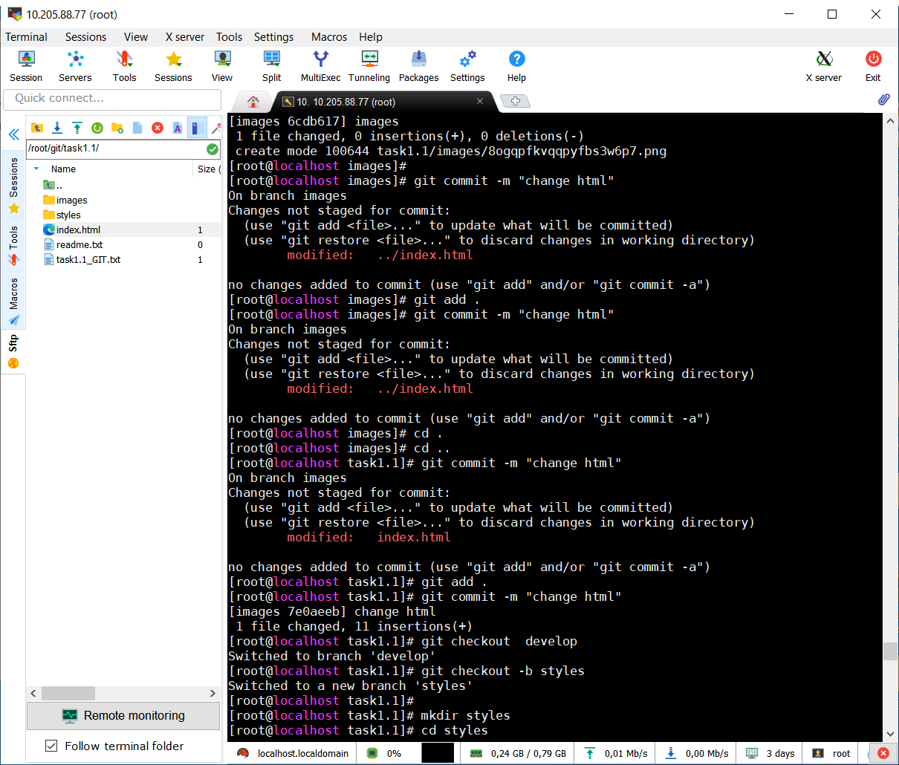

### Module 1. Task 1.1
I have installed Centos 8 in Virtual box. Then install Git.

Created a new repository and to fill it with some files.

Created several new branches. 

Next merged the branches and resolved the conflict in files.

The results of the work merged into the main branch and pushed to GitHub.

Here some screenshots:

 DevOps culture - is automatization and communication between all people and processes in the projects. It helps work more faster.
