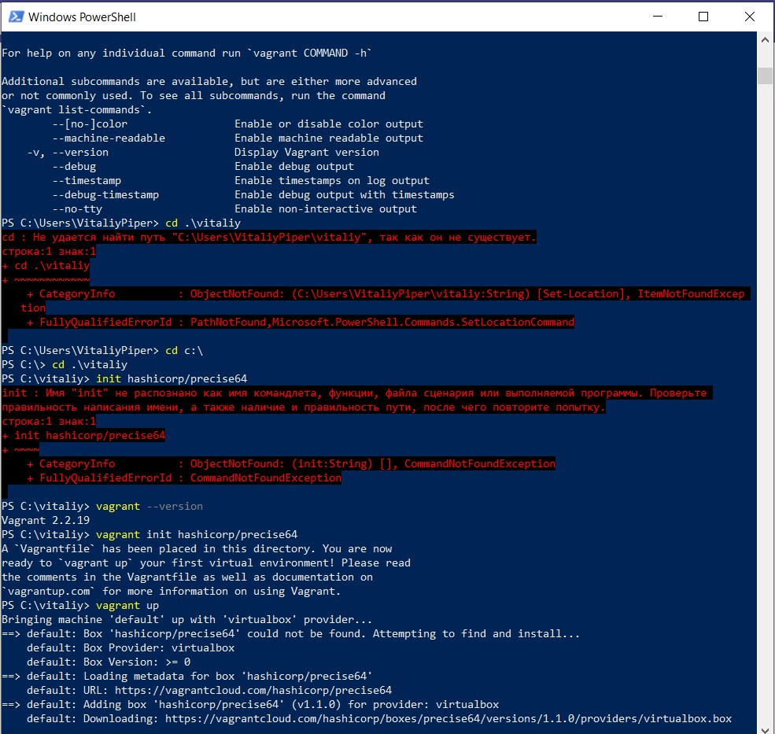

## Part 1 - Homework answers:
### 1.What are the most popular hypervisors for infrastructure virtualization?
Most popular hypervisors are VmWare, Xen, Proxmox and Qemu.
### 2.Briefly describe the main differences of the most popular hypervisors.
I worked only with VmWare early. It has many product for different purposes. VMware ESXi is server hypervisor with launched different OS. 
VMware vCenter is using to control them. It is commercial product but also is free version with restrictions.
***
## Part 2 - WORK WITH VIRTUALBOX:
Fig.1 - installed Virtual Box, create VM with Centos, cloning, grouping, check ip:

Fig.2 - create and manage snapshots:

Fig.3 - export and import operations

Fig.4 - Checking  the  connection between VM1, VM2, Host, Internet for different network modes.

Mode          | VM→Host       | VM←Host       |VM1↔VM2        |  VM→Net/LAN   |  VM←Net/LAN
------------- | ------------- | ------------- | ------------- | ------------- | -------------
Host-only     | +             | +             | +             |-              |-
Internal      | -             | -             | +             |-              |-
Bridged       | +             | +             | +             |+              |+
NAT           | +             | Port forward  | -             |-              |Port forward
NATservice    | +             | Port forward  | +             |+              |Port forward

Fig.5 - Work with CLI through VBoxManage

Fig.6 - Install, init and up Vagrant

Fig.7 - Connect via SSH, record time

Fig.8 - Stop and delete the created VM, create  own Vagrant box

