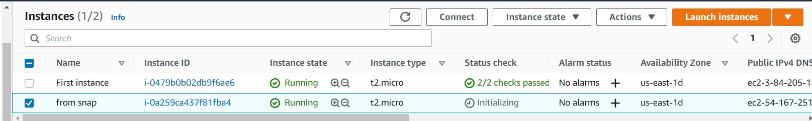
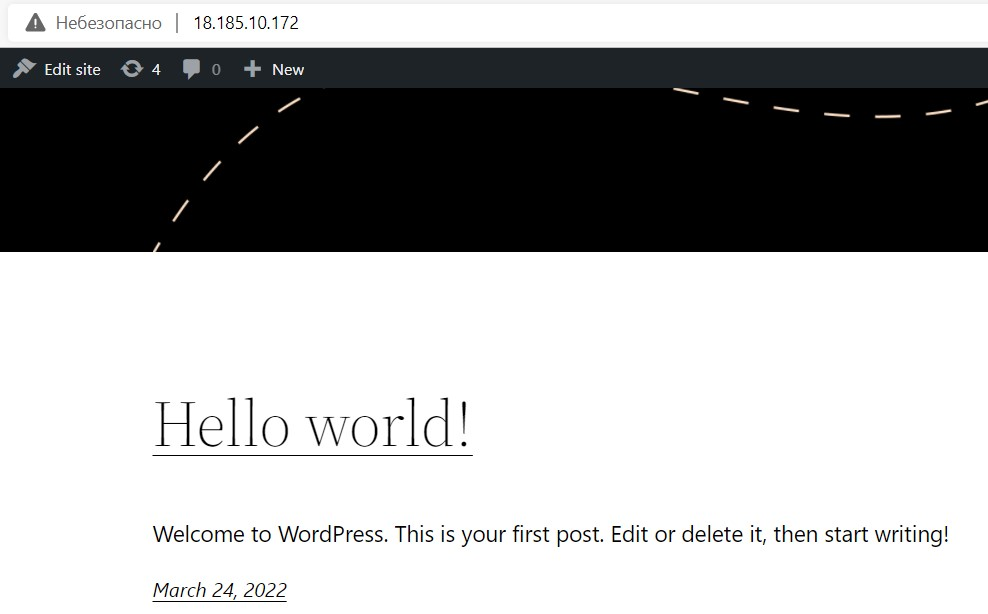

Fig.1 - Create snapshot of instance:

Fig.2 - Attached disk D:

Fig.3 - Launch the second instance from backup:

Fig.4 - attach disk_D to the new instance:

Fig.5 - Registered own domain name - vitalypiper.pp.ua:

Fig.6 - Hello world WordPress instance:

Fig.7 - Made S3 bucket:

Fig.8 - Working with CLI AWS:

Fig.8 - static website on Amazon S3:

 
 

