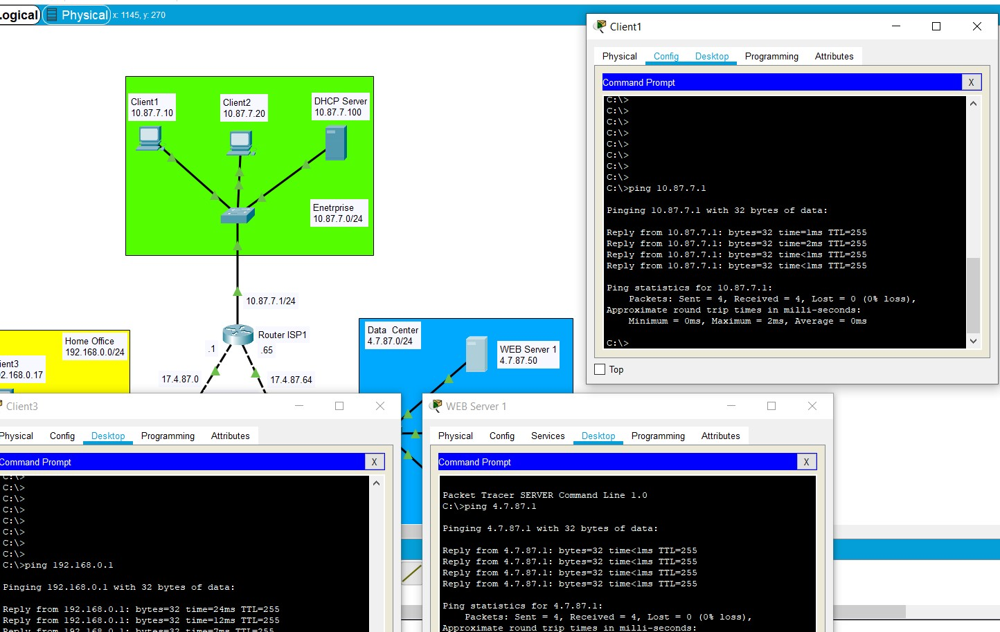
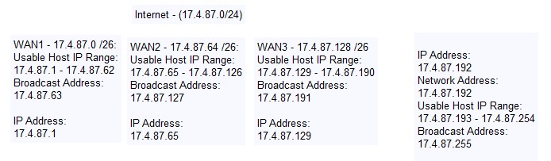
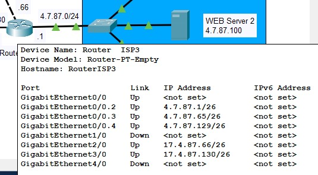
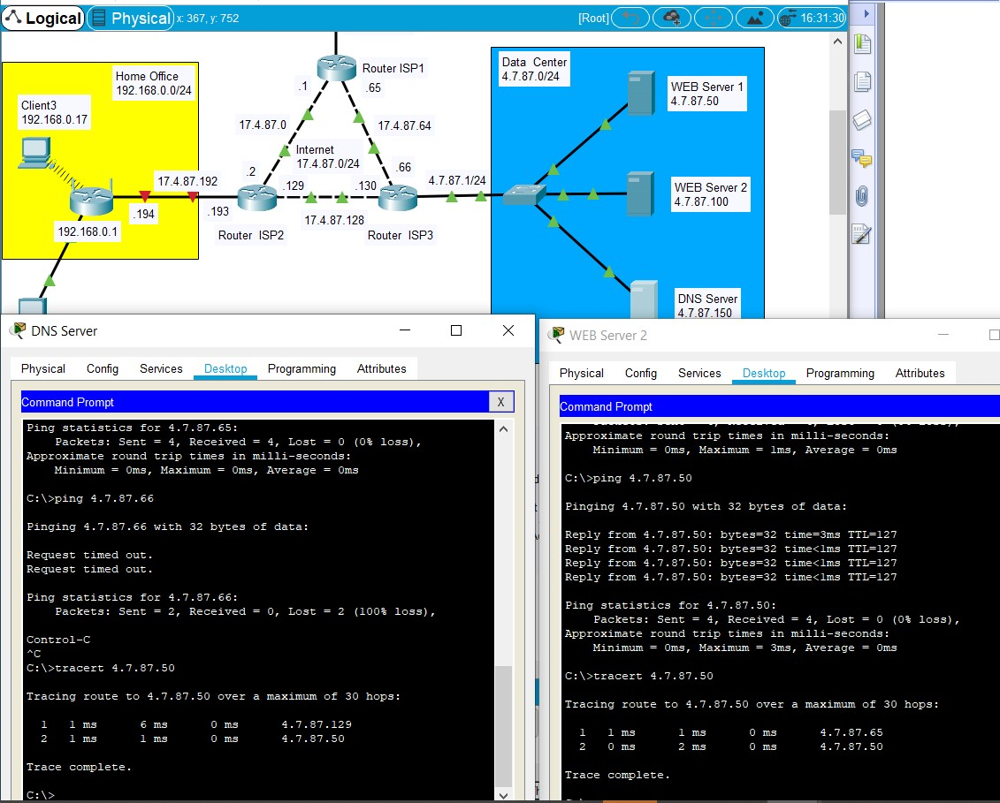

Fig.1 - Create Internet network with subnetworks:
| Router | Interface | Network IP-address  | Host IP-address |
| ------ | ----------|---------------------|-----------------|
| ISP1   | GE0/0     | 10.87.7.0/24        | 10.87.7.1       |
| ISP1   | GE1/0     | 17.4.87.0/26        | 17.4.87.1       |
| ISP1   | GE2/0     | 17.4.87.64/26       | 17.4.87.65      |
| ISP2   | GE0/0     | 17.4.87.192/26      | 17.4.87.193     |
| ISP2   | GE1/0     | 17.4.87.0/26        | 17.4.87.2       |
| ISP2   | GE3/0     | 17.4.87.128/26      | 17.4.87.129     |
| ISP3   | GE0/0     | 4.7.87.0/24         |                 |
| ISP3   | GE2/0     | 17.4.87.64/26       | 17.4.87.66      |
| ISP3   | GE3/0     | 17.4.87.128/26      | 17.4.87.130     |
| Home   | Internet  | 17.4.87.192/26      | 17.4.87.194     |

Checking connection:

Devide subnets  
  

After changing mask network to 255.255.255.192 connection was unreachable because with mask /26 avaliable number of usable hosts is 62. So web servers on different subnets cannot ping.

Setup  VLAN on Switch Data Center:  FE0/2 – VLAN2, FE0/3 – VLAN3, FE0/4 – VLAN4. Servers are also not available because they are on different vlan.
So wee need to setup routing between VLAN.
On router ISP3 create 3 VLAN subinterface:

After that all works fine

[Final project 3.2.pkt](https://github.com/hazard2005/DevOps_online_Odessa_2022Q1Q2/raw/main/m3/task3.2/projects/3.2.pkt)
