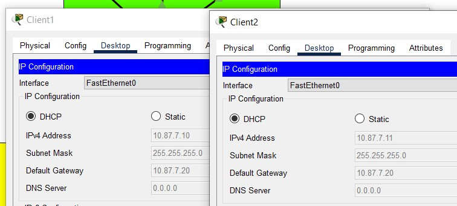
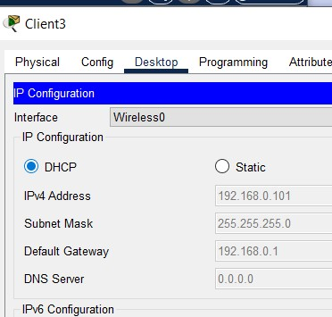
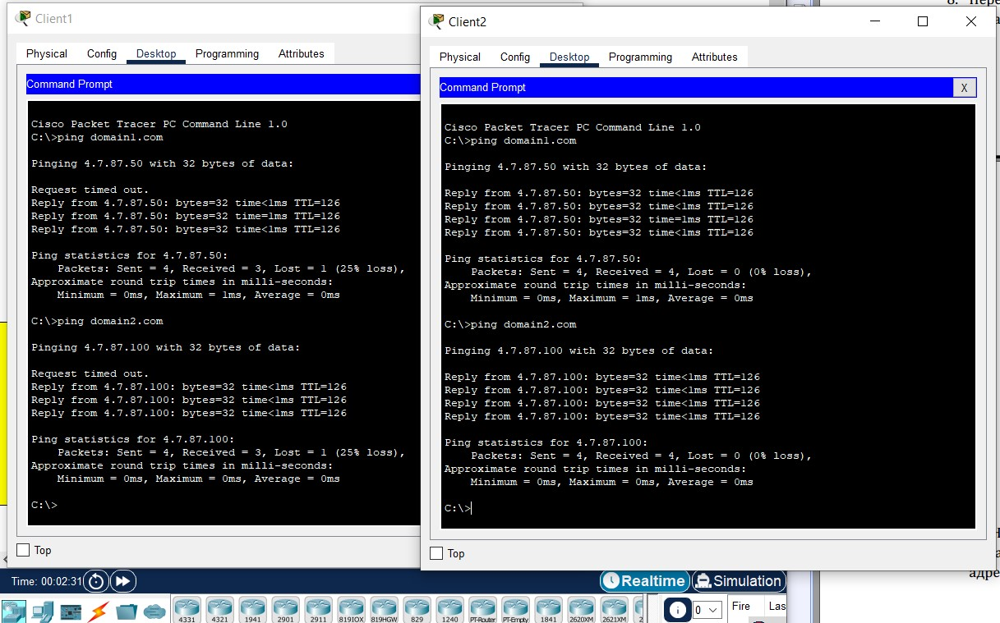
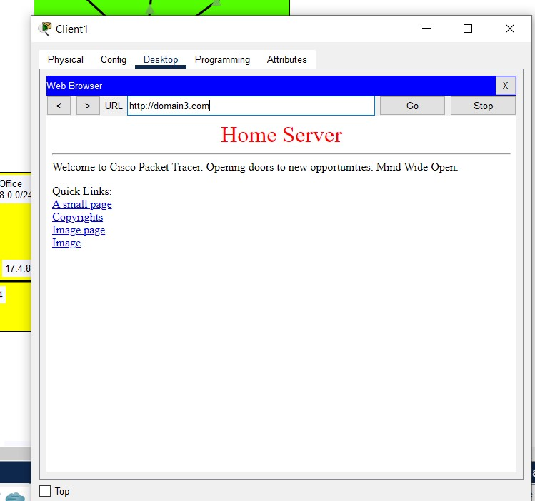

Fig.1 - Setup DHCP pool on Enterprise DHCP Server:
Checking IP on Client1 and Client2:

Fig.2 - Setup DHCP on Home Router:
Checking IP on Client3:

Fig.3 - Setup DNS on Data Center DNS Server:
Add A record for domain1.com and domain2.com, add DNS to DHCP Server settings
Checking ping to this domains:

Fig.4 - Add Home Server on Home Office network, edit index.html, enable port forwarding and add DNS to Home Server:
Check domain3.com in Web browser on Client1:

[Final project 3.4.pkt](https://github.com/hazard2005/DevOps_online_Odessa_2022Q1Q2/raw/main/m3/task3.4/projects/3.4.pkt)
