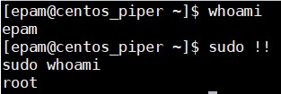

## Task1.Part1

*1) Log in to the system as root (or sudo-er).*  
Login as user Epam which is in wheel group.  
  
*2) Use the passwd command to change the password. Examine the basic parameters of the command. What system file does it change?*  
Command **`passwd`** changes file **`/etc/passwd`**.  
  
*3) Determine the users registered in the system, as well as  what commands they execute. What additional information can be gleaned from the command execution?*  
With command **`w`** we can get information about logged users, which terminal, IP, start of login, idle time, CPU usage, command they are doing.  
  
*4) Change personal information about yourself.*  
To change personal information use **`chfn`**.  
  
Check it.  
  
*5) Become familiar with the Linux help system and the man and info commands. Get help on the previously discussed commands, define and describe any two keys for these commands. Give examples.*  
Command **`w`** has this keys:  
  
I will try **`w`** with key **`-s`** (short format) and **`-h`** (without header).  
  
*6) Explore the more and less commands using the help system. View the contents of files .bash using commands.*  
View Bash history using **`more`**  
  
After end of file all listing is avaliable in terminal.  
View Bash history using **`less`**  
  
After end of file all listing not avaliable in terminal.  
*7) Determine the last logon time for all users.  Tip: You should read the documentation for the finger command.*  
**`lastlog | sort -k 4 | tail -7`**  
  
*8) List the contents of the home directory using the ls command, define its files and directories. Hint: Use the help system to familiarize yourself with the ls command.*  
Command **`ls`** has simply view.  
  
**`ls -la`** is more informative. It show show all hidden files and  use a long listing format.  
  
## Task1.Part2
*1) Examine the  tree  command. Master the technique of applying a template, for example, display all files that contain a character  c, or files that contain a specific sequence of characters. List subdirectories of the root directory up to and including the second nesting level.*  
**`tree`** has simle output.  
  
See files in home folder with character **`"c"`**. Add key **`-a`** we can see also hidden files.  
  
List root subdirectories.  
  
*2) What command can be used to determine the type of file (for example, text or binary)? Give an example.*  
Command **`file`** show information about file. I had found executable files, text files, directory, block and character devices. Also Linux has symbol link, pipes and sockets.  
  
*3) Master the skills of navigating the file system using relative and absolute paths. How can you go back to your home directory from anywhere in the filesystem?*  
Command **`cd`** helps to travel at filesystem. At the end of command prompt we see character ~. It indicate that we are in home directory now. Go to **`/etc/`**. Check our directory.  
  
I can return to home folder in several ways - **`cd`**, **`cd ~`**, **`cd /home/epam`** for user epam.  
  
*4) Become familiar with the various options for the ls command. Give examples of listing directories using different keys. Explain the information displayed on the terminal using the -l and -a switches.*  
Command **`ls`** has simply view.  
  
**`ls -la`** is more informative. It show show all hidden files **`-a`** and  use a long listing format **`-l`**.  
  
*5) Perform the following sequence of operations:*  
*- create a subdirectory in the home directory;*  
**`mkdir Folder`**  
*-  in this subdirectory create a file containing information about directories located in the root directory (using I/O redirection operations);*  
**`ls -ld .*/ */ >> ~/Folder/"Folder info".txt`**  
*- view the created file;*  
**`cat Folder/"Folder info".txt`**  
*-  copy the created file to your home directory using relative and absolute addressing.*  
**`cp Folder/"Folder info.txt" ~/"Folder info.txt"`** - copy via absolute path  
**`cp Folder/"Folder info.txt" /home/epam/"Folder info 2.txt"`** - copy via relative path  
*- delete the previously created subdirectory with the file requesting removal;*  
**`rm -ri Folder`**  
*- delete the file copied to the home directory.*  
**`rm -i "Folder info.txt" "Folder info 2.txt"`**  
  
*6) Perform the following sequence of operations:*   
*- create a subdirectory test in the home directory;*  
**`mkdir test`**  
*-  copy the  .bash_history  file to this directory while changing its name to labwork2;*  
**`cp .bash_history test/labwork2`**  
*- create a hard and soft link to the labwork2 file in the test subdirectory;*  
**`ln test/labwork2 test/hard_link_labwork2; ln -s ~/test/labwork2 ~/test/soft_link_labwork2`**  
*- how to define soft and hard link, what do these concepts;*  
By creating a hard link, we bind to its index number (inode), getting the same file and permissions (with a new name) that the link points to, but without physically creating a copy. A soft link points to a file name (path) and has other inode and permissions.  
*- change the data by opening a symbolic link. What changes will happen and why;*  
When I changed **`soft_link_labwork2`** its last modified time does not changed because it is only link to real file labwork2. The file **`labwork2`** and **`hard_link_labwork2`** were modified.  
*- rename the hard link file to hard_lnk_labwork2;*  
**`mv test/hard_link_labwork2 test/hard_lnk_labwork2`**  
*- rename the soft link file to symb_lnk_labwork2 file;*  
**`mv test/soft_link_labwork2 test/symb_lnk_labwork2`**  
*- then delete the labwork2. What changes have occurred and why?*  
**`rm test/labwork2`**  
Changes? Mmmm.... I delete file labwork2. Why? Because you ask me)) It's a joke :)  Hard link can still open, soft link not. Hard link is copy of deleted file and soft link is link to deleted file.  
   
*7) Using the locate utility, find all files that contain the squid and traceroute sequence.*  
**`locate -b squid traceroute`**  
   
*8) Determine which partitions are mounted in the system, as well as the types of these partitions.*  
**`df -hT`** -T wil show types of partitions.  
   
*9) Count the number of lines containing a given sequence of characters in a given file.*  
Which given file? Can count lines with previous command.  
**`df -hT | wc -l`**  
   
*10) Using the find command, find all files in the /etc directory containing the host character sequence.*  
**`sudo find /etc -name *host*`**  
  
*11) List all objects in /etc that contain the ss character sequence. How can I  duplicate a similar command using a bunch of grep?*  
**`ls -l /etc/*ss*`**  
  
**`ls -l /etc/ | grep ss`**  
  
*12) Organize a screen-by-screen print of the contents of the /etc directory. Hint:  You must use stream redirection operations.*  
**`ls /etc/ | tee output.txt | less`**  or **`ls /etc/ |tee output.txt | more`**  
*13) What are the types of devices and how to determine the type of device? Give examples.*  
 Linux supports three types of hardware device: character, block and network. Character devices are read and written directly without buffering. Block devices are accessed via the buffer cache and may be randomly accessed, that is to say, any block can be read or written no matter where it is on the device. Network devices are accessed via the BSD socket interface and the networking subsytems. The first character indicates the file type `- b - block device, c - character device and s - socket.` As you can see I don't have network devices.  
 **`ls -l /dev/sda /dev/tty`**  
   
*14) How to determine the type of file in the system, what types of files are there?*  
The seven standard Unix file types are regular, directory, symbolic link, FIFO special, block special, character special, and socket as defined by POSIX.  
The first character indicates the file type:  
`- - regular file;`  
`d - directory;`  
`b - block device;`  
`c - character device;`  
`l - symbolic link;`  
`p - pipe (pipe, fifo);`  
`s - socket.`  

**`ls -l /bin/ls /dev/sda /dev/tty /sbin/halt`**  
  
*15) List the first 5 directory files that were recently accessed in the /etc directory.*  
**`ls -lAhut /etc/ |head -5`**   
  