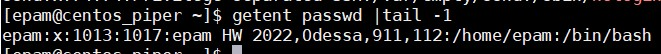

## Task2  
*1) Analyze the structure of the /etc/passwd and /etc/group file, what fields are present in it, what users exist on the system?*  
Structure of each line of **`/etc/passwd:`**  
**`1:x:2:3:4:5:6`** where  
`1 - User`  
`x - Password stored in /etc/shadow file`  
`2 - UID. The user identifier is a number assigned to each user.`  
`3 - GID. The user’s group identifier number, referring to the user’s primary group.`  
`4 - GECOS or the full name of the user. This field contains a list of comma-separated values with the following information - Name, Office, Office Phone and Home Phone.`  
`5 - Home directory. The absolute path to the user’s home directory.`  
`6 - Login shell. The absolute path to the user’s login shell.`  
Run **`getent passwd |tail -5`** to open the file **`/etc/passwd`** and show last users:  
  
Structure of each line of **`/etc/group:`**  
**`1:x:2:3`** where  
`1 - Group Name. This field stores a name of the group.`  
`x - Group Password. This field specifies a password of the group and is generally left blank. A value of x means password is stored in gshadow file for security reason. A blank value means no password is assigned to this group.`  
`2 - Group ID(GID) - Every group is assigned a GID and this field is the place where GID is stored. Group ID is also placed in GID field(fourth field) of /etc/passwd file.`  
`3 - Group Members. This field stores the usernames that belong to the group.`  
Run **`getent group |tail -6`** to open the file **`/etc/group`** and show last groups:  
  
*Specify several pseudo-users, how to define them?*  
Pseudo-users are users which run in background and no one will be able to log in under these users to the system because their logon shell parameter is **nologin**. Users of these names are not registered in 
the system and are only needed to confirm ownership of the processes.  
  
*2) What are the uid ranges?*  
UID ranges:  
- 0 reserved for root  
- 1-999 for pseudo-userd,daemon (sometimes 1-500)  
- 1000-65535 for regular users (sometimes 500 - 65535)  

*What is UID? How to define it?*  
UID is the number associated with the user account and stored in the /etc/passwd file on 3 position.  
  
1013 is **UID** of user epam.  
*3) What is GID? How to define it?*  
Group Identifier (GID) is a number associated with a group and stored in the /etc/passwd file on 4 position.  
  
1017 is **GUID** of user epam.  
*4) How to determine belonging of user to the specific group?*  
Run **`groups` user**  
  
*5) What are the commands for adding a user to the system? What are the basic parameters required to create a user?*  
Run **`user add` user**. Basic key is:  
b - path to home directory  
c - comment for account  
m - create home directory  
*6) How do I change the name (account name) of an existing user?*  
Run **`usermod -l` new_login old_login**  
*7) What is skell_dir? What is its structure?*  
Directory `/etc/skel/` contains files which must be copied to the new user's home directory.  
  
*8) How to remove a user from the system (including his mailbox)?*  
**`userdel -r` username`** remove `username` home directory and mail spool.  
*9) What commands and keys should be used to lock and unlock a user account?*  
To lock user use **`usermod -L` username**  
To unlock user use **`usermod -U` username**  
*10) How to remove a user's password and provide him with a password-free login for subsequent password change?*
To do this just **`passwd -de` username**. Key `-d` to delete password, key `-e` expire the password.  
  
*11) Display the extended format of information about the directory, tell about the information columns displayed on the terminal.*  
Run **`ls -lihA`** where -l is long listing format, -i show inode, -h is human readable, -A almost all files   
  
For example take the last file **`tree.txt`:**  
- 6001016 inode  
`-` is regular file  
rw-rw-r-- is file permissions  
1 is number of linked hard-links  
epam - owner of the file
epam - to which group this file belongs to
59K - size of file
Jun  2 07:54 is modification/creation date and time
tree.txt - file name
*12) What access rights exist and for whom (i. e., describe the main roles)? Briefly describe the acronym for access rights.*  
Each file or directory has three basic permission types:  
**`read` r** – the read permission refers to a user’s capability to read the contents of the file.  
**`write` w** – the write permissions refer to a user’s capability to write or change a file or directory.  
**`execute` x** – the execute permission affects a user’s capability to execute a file or view the contents of a directory.  
Each file and directory has three user based permission groups (ugo):  
**`user`** – the owner permissions apply only to the owner of the file or directory.  
**`group`** – the group permissions apply only to the group that has been assigned to the file or directory.  
**`others`** – all users permissions apply to all other users on the system. 
In finally full rights look like this: **`rwxrwxrwx`**  
*13) What is the sequence of defining the relationship between the file and the user?*  
Any Linux user in relation to any file can act in three roles: as the owner (user), as 
a member of the group that owns the file (group), and as an outsider (other), has no ownership relations 
of this file.  
*14) What commands are used to change the owner of a file (directory), as well as the mode of access to the file? Give examples, demonstrate on the terminal.*  
To change file owner:  
Use **`chown` username filename**   
To change file rights:  
Use **`chmod 777 file.txt`**  
or
Use **`chmod g-x,o-wx file.txt`**  
  
*15) What is an example of octal representation of access rights? Describe the umask command.*  
|Octal Value |	File Permissions Set |	Permissions Description |
--------|-----------|------------
	0 	|	---		|	No permissions 
	1	|	--x 	|	Execute permission only 
	2 	|	-w-	 	|	Write permission only 
	3	|	-wx 	|	Write and execute permissions 
	4 	|	r-- 	|	Read permission only 
	5 	|	r-x 	|	Read and execute permissions 
	6 	|	rw- 	|	Read and write permissions 
	7 	|	rwx 	|	Read, write, and execute permissions 
*16) Give definitions of sticky bits and mechanism of identifier substitution. Give an example of files and directories with these attributes.*  
Sticky Bit is mainly used on folders in order to avoid deletion of a folder and it’s content by other users though they having write permissions on the folder contents. If Sticky bit is enabled on a folder, the folder contents are deleted by only owner who created them and the root user.  
Create folder with Sticky bit and setup it:  
**`mkdir "folder Sticky bit"`**  
**`ls -ld "folder Sticky bit"`**  
**`chmod +t "folder Sticky bit"`**  
**`ls -ld "folder Sticky bit"`**
  
*17) What file attributes should be present in the command script?*  
When you run script with shell only read permission needed. Youn need add execute permission to run without shell.  
**`ls -l`**  
**`sh hello.sh`**  
**`./hello.sh`**  
**`chmod u+x hello.sh`**  
**`ls -l`**  
**`./hello.sh`**  
  
