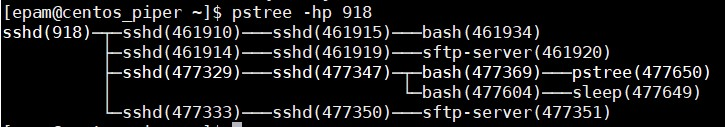
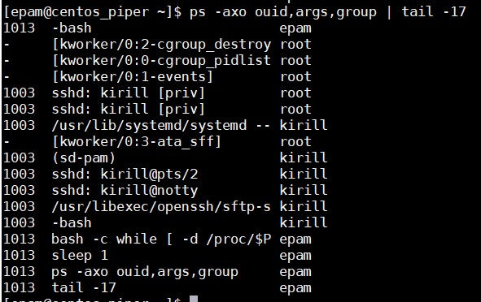
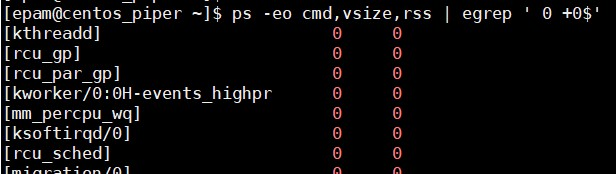
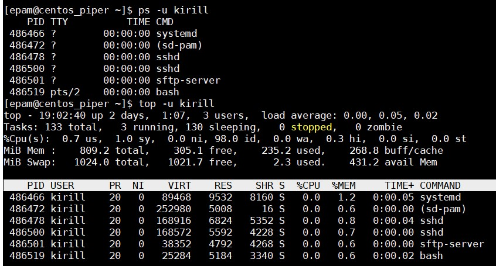
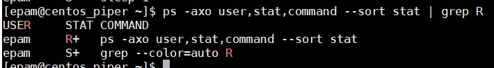

## Part1  
*1. How many states could has a process in Linux?*  
Process in Linux could has 5 states:  
- CREATED  
- READY  
- RUNNING  
- WAITING  
- TERMINATED   
*2. Examine the pstree command. Make output (highlight) the chain (ancestors) of the current process.*  
Run **`pstree`** with key `-p` to know PID. Then add PID bumber to pstree.  
  
*3. What is a proc file system?*  
Proc file system (procfs) is virtual file system created on fly when system boots. It contains useful information about the processes that are currently running. Path is /proc  
*4. Print information about the processor (its type, supported technologies, etc.).*  
Use **`lscpu`** or **`cat /proc/cpuinfo`**  
*5. Use the ps command to get information about the process. The information should be as follows: the owner of the process, the arguments with which the process was launched for execution, the group owner of this process, etc.*  
**`ps -axo ouid,args,group | tail -17`**  
  
*6. How to define kernel processes and user processes?*  
Answers from stackoverflow and stackexchange:  
User-space processes have its own virtual address space.  
Kernel processes or threads do not have their own address space, they operate within kernel address space only. And they may be started before the kernel has started any user process (e.g. init).  
Kernel threads do not use RAM at all (or at least are displayed not to use any):  
**`ps -eo cmd,vsize,rss | grep -E ' 0 +0$'`**  
Also it is easy to recognize the kernel processes because they have a name that is between square brackets.  
  
*7. Print the list of processes to the terminal. Briefly describe the statuses of the processes. What condition are they in, or can they be arriving in?*  
Process in Linux can be:  
- D = UNINTERRUPTABLE_SLEEP  
- S = INTERRRUPTABLE_SLEEP  

During process execution, it might come across a portion of its code where it needs to request external resources. Mainly, the request for these resources is IO-based such as to read a file from disk or make a network request. Since the process couldn’t proceed without the resources, it would stall and do nothing. In events like these, they should give up their CPU cycles to other tasks that are ready to run, and hence they go into a sleeping state.  
- R = RUNNING & RUNNABLE. 

In the running state, the process takes up a CPU core to execute its code and logic.   
- T = STOPPED  

From a running or runnable state, we could put a process into the stopped state (T) using the SIGSTOP or SIGTSTP signals. The difference between both signals is that we send the SIGSTOP is programmatic, such as running kill -STOP {pid}. 
- Z = ZOMBIE  

When a process has completed its execution or is terminated, it’ll send the SIGCHLD signal to the parent process and go into the zombie state. The zombie process, also known as a defunct process, will remain in this state until the parent process clears it off from the process table.  
*8. Display only the processes of a specific user.*  
Run **`ps -u username`**  
  
*9. What utilities can be used to analyze existing running tasks (by analyzing the help for the ps command)?*  
Run **`ps -axo user,stat,command --sort stat | grep R`**  
  
*10. What information does top command display?*  
Top display system summary information as well as a list of processes or threads currently being managed by the Linux kernel. 
*11. Display the processes of the specific user using the top command.*  
Run **`top -u username`**  
  
*12. What interactive commands can be used to control the top command? Give a couple of examples.*  
z - color mono  
u - select user  
k - kill  
r - renice  
h - help  
q - quit
*13. Sort the contents of the processes window using various parameters (for example, the amount of processor time taken up, etc.)*  
Top can sort by hot keys:  
|%MEM|Shift+M| Memory usage|
|----|-------|-------------|
|TIME|Shift+T|Time usage|
PID|Shift+N|PID sort|
%CPU|Shift+P|Processor usage|
    |Shift+F|Other fields|  
*14. Concept of priority, what commands are used to set priority?*  
The computer shares its processing time between all of the running processes. Certain processes can have a higher priority than others. Use **`renice` priority PID**  
  
*15. Can I change the priority of a process using the top command? If so, how?*  
Yes, just press `r` then enter PID and priority from 0 to 20 or -20 to 20 (root needed).  
*16. Examine the kill command. How to send with the kill command process control signal? Give an example of commonly used signals.*  
Frequently using:  
SIGTERM 15 - Signals to terminate the process or the software (safety).  
SIGKILL 9 - Process will quit immediately with loosing all data.  
**`kill -9 587171`**  
*17. Commands jobs, fg, bg, nohup. What are they for? Use the sleep, yes command to demonstrate the process control mechanism with fg, bg.*  
Run **`ping i.ua >>null &`** and `&` move ping to background or press Ctrl+Z. To see all background processes run **`jobs`**.  
To move foreground run `fg n`, where `n` is number of jobs. To move background run `bg`.  
##Part2  
*1. Check the implementability of the most frequently used OPENSSH commands in the MS Windows operating system. (Description of the expected result of the commands +screenshots: command – result should be presented)*  
On Windows workstation:  
Check SSH is present - **`ssh`**.   
Connect to remote Linux PC with password - **`ssh epam@192.168.1.50`**  
Check hostname and working directory - **`hostname`**, **`pwd`**  
  
Setup to connect with key. 
Generate key - **`ssh-keygen -t rsa -b 4096 -f C:\Users\VitaliyPiper\.ssh\epam_ssh_rsa -C "epam" -P ""`**  
Windows does not have ssh-copy-id so doing some manual work. I can't find simple solution in Google so I make some command sequence.  
First of all make directory .ssh, then change rights and copy public key to remote PC.  
**`ssh epam@192.168.1.50 mkdir ~/.ssh; chmod 700 ~/.ssh & scp C:\Users\VitaliyPiper\.ssh\epam_ssh_rsa.pub epam@192.168.1.50:~/.ssh/temp_key`**  
Then copy public key in file `authorized_keys`, change rights and remove temp public key.  
**`ssh epam@192.168.1.50 "cat ~/.ssh/temp_key >> ~/.ssh/authorized_keys && chmod 600 ~/.ssh/* && rm ~/.ssh/temp_key"`**  

Try to connect without password:  
**`ssh -i C:\Users\VitaliyPiper\.ssh\epam_ssh_rsa epam@192.168.1.50`**  
Connection successful!  
  
*2. Implement basic SSH settings to increase the security of the client-server connection (at least)*  
To improve the security of the remote server do next steps:  
- Disable Server SSH Root Login  
- Allow access only to specific users and groups  
- Disable Password-Based Logins  
- Change default port 22 below 1024 and and do not use similar ports 222, 2222, 22222  
- Allow access only to specific IP  
- Use Fail2ban  
*3. List the options for choosing keys for encryption in SSH. Implement 3 of them.*  
Let's see what types of keys are available:  
  
Let's try generate all of them:  
**`ssh-keygen -t rsa -P "" && ssh-keygen -t dsa -P "" && ssh-keygen -t ed25519 -P ""`**  
  
*4. Implement port forwarding for the SSH client from the host machine to the guest Linux virtual machine behind NAT.*  

*5. Intercept (capture) traffic (tcpdump, wireshark) while authorizing the remote client on the server using ssh, telnet, rlogin. Analyze the result.*  
 