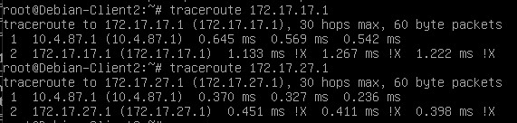
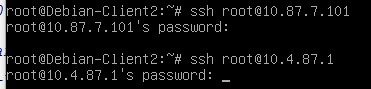

### EPAM University Programs DevOps external course  
## Module – Linux Networking  
Network Ip adressess:  
|Net|IP|
|-------|--------|
|Net1 |192.168.1.0/24|
|Net2 |10.87.7.0/24|
|Net3 |10.4.87.0/24|
|Net4 |172.16.7.0/24|

|       |Server_1 (Centos)|Client_1 (Centos)  |Client_2 (Debian)|
|-------|-----------------|-------------------|-----------------|
|IP int1|192.168.1.200	  |	10.87.7.101		  |10.4.87.100|
|IP int2|10.87.7.1	 	  |172.16.7.10		  |172.16.7.12|
|IP int3|10.4.87.1	  	  |			 		  |			|

*1. На Server_1 налаштувати статичні адреси на всіх інтерфейсах.*  
Check avaliable interfaces: **`nmcli con show`**  
Create connections:  
**`nmcli con add ifname enp0s8 type ethernet con-name "enp0s8"`**  
**`nmcli con add ifname enp0s9 type ethernet con-name "enp0s9"`**  
Setup static IP:  
**`nmcli connection modify enp0s8 ipv4.method manual ipv4.addresses 10.87.7.1/24`**  
**`nmcli connection modify enp0s9 ipv4.method manual ipv4.addresses 10.4.87.1/24`**  
Up all interfaces and check it:  
**`systemctl restart network`**  
**`nmcli con show`**  
**`ip a|grep -w 'inet'`**  
  
*2. На  Server_1  налаштувати  DHCP  сервіс,  який  буде  конфігурувати  адреси  Int1 Client_1 та Client_2*  
Install DHCP:  
**`dnf install dhcp-server`**  
Configure dhcpd.conf:  
```**default-lease-time 600;
max-lease-time 7200;
authoritative;
subnet 10.87.7.0 netmask 255.255.255.0 {
  range 10.87.7.100 10.87.7.200;
  option routers 10.87.7.1;
  option domain-name-servers 10.87.7.1, 8.8.8.8;
}
subnet 10.4.87.0 netmask 255.255.255.0 {
  range 10.4.87.100 10.4.87.200;
  option routers 10.4.87.1;
  option domain-name-servers 10.4.87.1, 8.8.8.8;
}**  
```
Enable autorun and start service:  
**`systemctl enable dhcpd`**  
**`systemctl start dhcpd`**  
Add rules to firewall:  
**`firewall-cmd --permanent --add-service=dhcp`**  
**`firewall-cmd --reload`**  

Setup connection on Client_1:  
**`nmcli con add ifname enp0s8 type ethernet con-name "enp0s8"`**  
**`nmcli con add ifname enp0s9 type ethernet con-name "enp0s9"`**  
**`nmcli con modify enp0s9 ipv4.method manual ipv4.addresses 172.16.7.10/24`**  


Check IP:  
**`ip a|grep -w 'inet'`**  
  

Setup connection on Client_2:
**`touch /etc/netplan/dynamic.yaml`**  

```network:
  renderer: networkd
  ethernets:
     enp0s8:
         dhcp4: true
  version: 2```

**`touch /etc/netplan/static.yaml`**  

```network:
  renderer: networkd
  ethernets:
     enp0s9:
         dhcp4: no
		 addresses: [172.16.7.12/24]
  version: 2```

**`netplan try`**  
**`netplan apply`**  

Check IP:  
**`ip a|grep -w 'inet'`**  
  

Check IP leases on DHCP server:  
**`cat /var/lib/dhcpd/dhcpd.leases`**  

*3. За допомогою команд ping та traceroute   перевірити зв'язок між віртуальними машинами. Результат пояснити.*  
Ping and traceroute addresses from Client_1 to Client_2 via int2:  
  
 Ping and traceroute addresses from Client_1 to Client_2 via int1:  
 There are no connection via Server_1 because IP forvarding was off on Server_1.  
 Setup IP forvarding:  
**`vim /etc/sysctl.conf`**  
Add **`net.ipv4.conf.all.forwarding=1`**  
Restart network service:  
**`systemctl restart systemd-sysctl.service`**  
Connection appeared:  
  
*4. На  віртуальному  інтерфейсу  lo  Client_1  призначити  дві  ІР  адреси  за  таким правилом:  172.17.D+10.1/24  та  172.17.D+20.1/24.*  
On Client_1:  
**`ip addr add 172.17.17.1/24 dev lo`**  
**`ip addr add 172.17.27.1/24 dev lo`**  
**`ip a|grep -w 'inet'`**  
   
*Налаштувати  маршрутизацію таким чином, щоб трафік з Client_2 до 172.17.D+10.1 проходив через Server_1, а до 172.17.D+20.1 через Net4. Для перевірки використати traceroute.*  
On Server_1:  
**`ip route add 172.17.17.0/24 via 10.87.7.101`**  
On Client_2:  
**`ip route add 172.17.27.0/24 via 172.16.7.12`**   
Check routes:  
  
*5. Розрахувати  спільну  адресу  та  маску  (summarizing)  адрес  172.17.D+10.1  та 172.17.D+20.1,  при  чому  маска  має  бути  максимально  можливою.  Видалити маршрути,  встановлені  на  попередньому  кроці  та  замінити  їх  об’єднаним маршрутом, якій має проходити через Server_1.*  
On Server_1 set static route:  
**`ip route add 172.17.16.0/20 via 10.87.7.101`**  
  
*6. Налаштувати  SSH  сервіс  таким  чином,  щоб  Client_1  та  Client_2  могли підключатись до Server_1 та один до одного.*  
From Client_1 to Server_1 and Client_2:  
  
From Client_2 to Server_1 and Client_1:  
  
*7. Налаштуйте на Server_1 firewall таким чином:*  
-  *Дозволено підключатись через SSH з Client_1 та заборонено з Client_2*  
On Server_1 I have firewalld instead iptables, so going to set up it for the first time. Move interface enp0s3 to external zone and interfaces enp0s8 and enp0s9 to internal.  
**`firewall-cmd --permanent --change-interface=enp0s3 --zone=external`**  
**`firewall-cmd --permanent --change-interface=enp0s8 --zone=internal`**  
**`firewall-cmd --permanent --change-interface=enp0s9 --zone=internal`**  
**`firewall-cmd --reload`**  
SSH is already enable in External zone. So both clients can connect via SSH to Server_1. Deny SSH for Client_2 using rich rule.  
**`firewall-cmd --permanent --zone=internal --add-rich-rule 'rule family="ipv4" source address="10.4.87.100" service name="ssh" reject'`**  
**`firewall-cmd --reload`**  
Client_1 - success connect:  
  
Client_2 - connect refused:  
  
-  *З Client_2 на 172.17.D+10.1 ping проходив, а на 172.17.D+20.1 не проходив*  
I can't find a solution to do this with Firewalld. Only block all ICMP or accept.  
*8. Якщо в п.3 була налаштована маршрутизація для доступу  Client_1 та Client_2 до мережі Інтернет –  видалити відповідні записи. На Server_1  налаштувати NAT сервіс таким чином, щоб з Client_1 та Client_2 проходив ping в мережу Інтернет*  
On External zone masquarade is already enabled. But in other zone it can be turned on by command:  
**`firewall-cmd --zone=NewZone --add-masquerade --permanent`**  
  