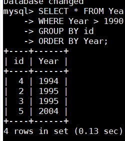

### Module 7 Database Administration 
## TASK 7.1 

# PART 1  
*1. Download MySQL server for your OS on VM.*  
*2. Install MySQL server on VM.*  
  
*3. Select a subject area and describe the database schema, (minimum 3 tables)*  
*4. Create a database on the server through the console.*  
```
CREATE DATABASE Music_Library;
USE Music_Library
```
*5. Fill in tables.*  
  
*6. Construct and execute SELECT operator with WHERE, GROUP BY and ORDER BY.*  
```
SELECT * FROM Year
WHERE Year > 1990
GROUP BY id
ORDER BY Year;
```
  
*7. Execute other different SQL queries DDL, DML, DCL.*  

DDL - RENAME, DML - DELETE, DCL - GRANT  
```
RENAME TABLE Genre TO subGenre;
DELETE from subGenre where Genre='Acoustic';
```
GRANT below.  
*8. Create a database of new users with different privileges. Connect to the database as a new user and verify that the privileges allow or deny certain actions.*  
```
CREATE DATABASE test_users;
USE test_users
```

```
CREATE USER 'newuser'@'localhost' IDENTIFIED BY 'password';
GRANT CREATE, INSERT, SELECT ON Music_Library.* TO 'newuser'@'localhost';
FLUSH PRIVILEGES;
```
Login in MySQL with newuser
```
show databases;
create database test;
use Music_Library;
CREATE TABLE Comment( id int AUTO_INCREMENT, Comment varchar(40), PRIMARY KEY (id) );
INSERT INTO Comment (Comment) VALUES ('Test');
delete from Comment where Comment='Test';
```
  
*9. Make a selection from the main table DB MySQL.*  

`SELECT * FROM mysql.user;`  
  

## PART 2 
*10.Make backup of your database.*  
```mysqldump --databases Music_Library > db_backup.sql```  
*11.Delete the table and/or part of the data in the table.*  
```
DROP TABLE Music_Library.Comment;
show tables;
```  
  
*12.Restore your database.*  

```
mysql Music_Library  < db_backup.sql
show tables;
```  
*13.Transfer your local database to RDS AWS.*  
```mysql -u main -p lab-password -h lab-db.cdemdlwkcamo.us-east-1.rds.amazonaws.com < db_backup.sql```  
*14.Connect to your database.*  
*15.Execute SELECT operator similar step 6.*  
  
*16.Create the dump of your database.*  
```mysqldump -u main -p -h lab-db.cdemdlwkcamo.us-east-1.rds.amazonaws.com --databases Music_Library> amazon_db_backup.sql```

## PART 3 – MongoDB 
*17. Create a database. Use the use command to connect to a new database (If it doesn't exist, Mongo will create it when you write to it).*  
  
```use demo;```  

*18. Create a collection. Use db.createCollection to create a collection. I'll leave the subject up to you. Run show dbs and show collections to view your database and collections.*  
```db.createCollection ("Test_collection")
show dbs
show collections```  
  
*19. Create some documents. Insert a couple of documents into your collection. I'll leave the subject matter up to you, perhaps cars or hats.*  
```db.books.insertOne({title: "MongoDB", likes: 100});
db.books.insertMany([{title: "a"}, {name: "b"}]);```
*20. Use find() to list documents out.*  
```db.books.find({})```
  